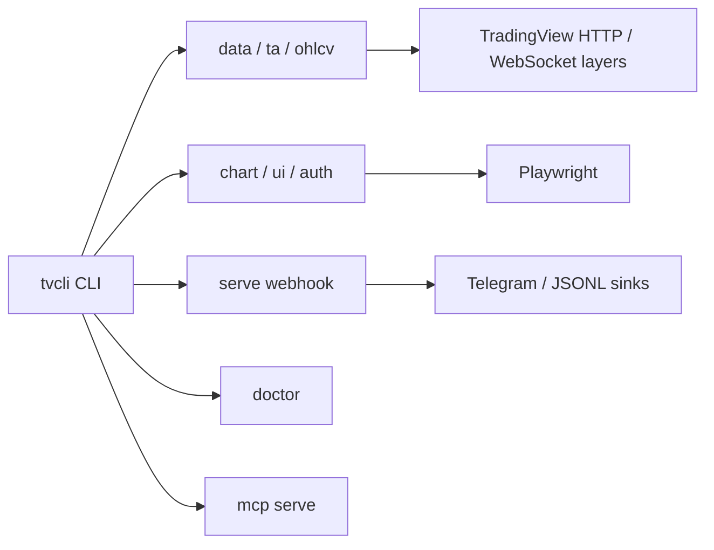

# tvcli

`tvcli` is a TradingView CLI toolkit planned for phased implementation.

## Status

Phase Z hardening complete. The authoritative design lives in `SPEC.md` and
`IMPLEMENTATION_PLAN.md`.

## Usage

The intended install path is:

```bash
just install
```

Quick-start examples:

```bash
tvcli version --json
tvcli doctor --json
tvcli data screen --market turkey --select name,close,volume --where "RSI<30" --limit 20 --json
tvcli data fields --market turkey --search rsi --json
tvcli ta get BIST:THYAO --interval 1d --json
tvcli ta matrix BIST:THYAO --intervals 1h,4h,1d --json
tvcli serve webhook --port 8787 --secret TOKEN --sink stdout
tvcli mcp serve
```

The `data`, `ta`, `auth`, `ohlcv`, `chart`, `ui`, and `serve` surfaces are wired
into the CLI; browser-backed commands require a saved TradingView session. Use
`--retries N --backoff SECONDS` for retryable upstream failures.

## Architecture



## Cron Examples

```cron
0 * * * * /usr/bin/tvcli ta matrix BIST:THYAO --intervals 1h,4h,1d --json >> /var/log/tvcli-ta.jsonl
15 9 * * 1-5 /usr/bin/tvcli data screen --market turkey --select name,close,RSI --where "RSI<30" --json >> /var/log/tvcli-screen.jsonl
# Keep the local BIST free-float archive current (reports lag one business day):
30 19 * * 1-5 /usr/bin/tvcli data float-sync --latest --json >> /var/log/tvcli-float.jsonl
```

## Free-float archive (BIST fiili dolaşım)

`tvcli` keeps a persistent local archive of VAP/MKK free-float ratios at
`~/.local/share/tvcli/archive.sqlite3`. Reads are local-first: `data float`,
`chart signal`, and `chart analyze --auto` use the archive and only hit VAP on a
miss (writing the result through).

One-time historical backfill (resumable, gentle inter-request throttle — safe to
interrupt and re-run with `--resume`):

```bash
nohup tvcli data float-sync --since 2024-01-01 --resume --rate-seconds 20 --json \
  >> backfill.log 2>&1 &
tvcli data float-stats --json   # watch coverage grow
```

Per-symbol analytics from the archive (no network):

```bash
tvcli data float-report THYAO --json     # trend, deltas, risk events, percentile, liquidity
tvcli data float-history THYAO --json
tvcli data float-events --severity high --json
```

Check archive coverage and find gaps:

```bash
tvcli data float-verify --since 2024-01-01 --until 2026-06-11 --json
# → {business_days, stored, known_empty, gaps: [...], coverage_pct}
```

Render free-float PNG dashboards (headless matplotlib, no browser):

```bash
# Single-symbol deep dive: ratio history + threshold lines + event markers
tvcli data float-dashboard THYAO --out thyao_float.png --json

# Market-wide overview: distribution histogram + lowest-float leaderboard
tvcli data float-dashboard --market --out bist_float_overview.png --json
```

`chart signal BIST:THYAO` includes a `free_float_trend` vote (derived from the
last 20 archived ratio readings) alongside the price-derived votes. Falling float
dampen signal confidence; rising float adds mild directional context.

## Claude Code

The agent-facing command contract lives in `.claude/skills/tvcli/SKILL.md`.
Keep it aligned with the JSON envelope, exit codes, and recovery behavior when
the CLI changes.

## Disclaimer

This project relies on unofficial TradingView endpoints for some features. Use it for personal workflows with conservative rate limits. Do not use it to bypass CAPTCHA, anti-bot controls, or TradingView terms.
