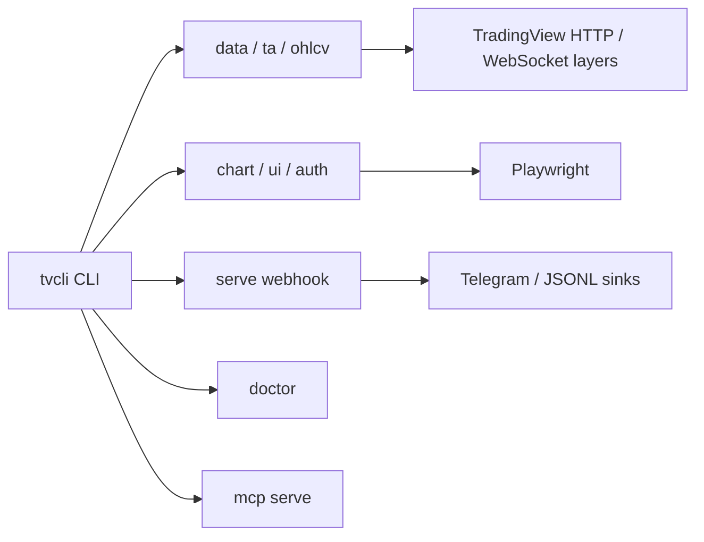

# tvcli

`tvcli` is a TradingView CLI toolkit planned for phased implementation.

## Status

Phase Z hardening complete. The authoritative design lives in `SPEC.md` and
`IMPLEMENTATION_PLAN.md`.

## Usage

The intended install path is:

```bash
just install
```

Quick-start examples:

```bash
tvcli version --json
tvcli doctor --json
tvcli data screen --market turkey --select name,close,volume --where "RSI<30" --limit 20 --json
tvcli data fields --market turkey --search rsi --json
tvcli ta get BIST:THYAO --interval 1d --json
tvcli ta matrix BIST:THYAO --intervals 1h,4h,1d --json
tvcli serve webhook --port 8787 --secret TOKEN --sink stdout
tvcli mcp serve
```

The `data`, `ta`, `auth`, `ohlcv`, `chart`, `ui`, and `serve` surfaces are wired
into the CLI; browser-backed commands require a saved TradingView session. Use
`--retries N --backoff SECONDS` for retryable upstream failures.

## Architecture



## Cron Examples

```cron
0 * * * * /usr/bin/tvcli ta matrix BIST:THYAO --intervals 1h,4h,1d --json >> /var/log/tvcli-ta.jsonl
15 9 * * 1-5 /usr/bin/tvcli data screen --market turkey --select name,close,RSI --where "RSI<30" --json >> /var/log/tvcli-screen.jsonl
```

## Claude Code

The agent-facing command contract lives in `.claude/skills/tvcli/SKILL.md`.
Keep it aligned with the JSON envelope, exit codes, and recovery behavior when
the CLI changes.

## Disclaimer

This project relies on unofficial TradingView endpoints for some features. Use it for personal workflows with conservative rate limits. Do not use it to bypass CAPTCHA, anti-bot controls, or TradingView terms.
